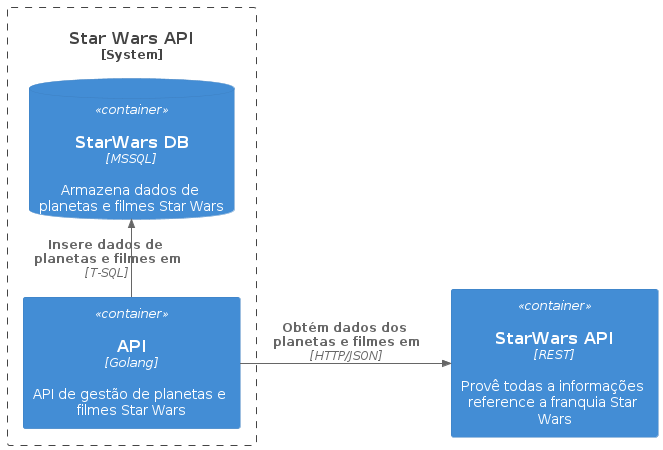
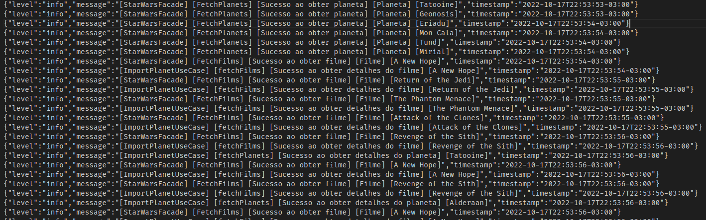
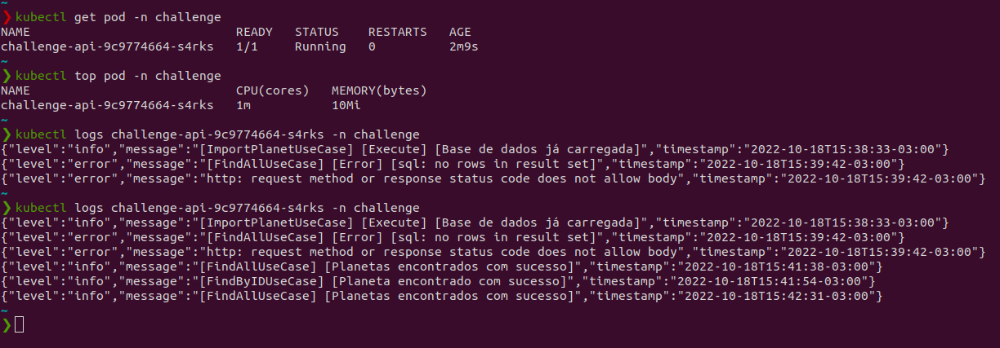
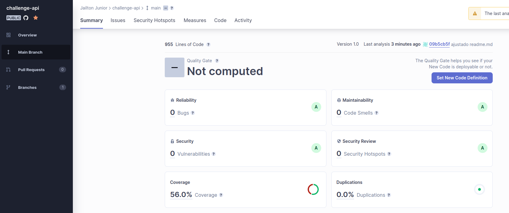

# Proposta

Gostaríamos de criar um jogo de Star Wars com algumas informações da franquia. E para possibilitar a
equipe de frontend criar essa aplicação, precisamos desenvolver uma API REST que contenha os dados dos
planetas da franquia.

# Escopo
Para cada planeta, os seguintes dados devem ser obtidos do banco de dados da aplicação, inseridos a partir
de requisições disparadas para a API pública do Star Wars:
- Nome, clima e terreno;
- Para cada planeta também devemos ter os filmes com o nome, diretor e data de lançamento;
  
Todas as informações necessárias podem ser obtidas pela API pública do [Star Wars](https://swapi.dev/).
- Funcionalidades desejadas:
- Carregar um planeta da API através do Id
- Listar os planetas
- Buscar planeta por nome
- Buscar por ID
- Remover planeta

# Requisitos
- utilize git ou hg para fazer o controle de versão da solução do teste e hospede-a no Github ou Bitbucket;
- armazene os dados no banco de dados que você julgar apropriado;
- a API deve seguir os conceitos REST;
- o Content-Type das respostas da API deve ser application/json ;
- o código da solução deve conter testes e algum mecanismo documentado para - gerar a informação de
cobertura dos testes;
- a aplicação deve gravar logs estruturados em arquivo texto;

# Desenho da Solução
<p align="center">
  
</p>

# Testes de unidade
- Para executar os testes de unidade, devemos utilizar os comandos <strong>[Os comandos abaixo executa os testes de unidade e gera o arquivo com a cobertura]</strong>
  ```
  make test
  ```
  ou
  ```
  go test -v --coverprofile tests/coverage.out ./...
  go tool cover -html=tests/coverage.out
  ```

# Executando com Docker
- Para executar o projeto local com docker, devemos utilizar os comandos <strong>[Os comandos abaixo gera um container de banco de dados, faz criação das tabelas e executa a API]</strong>
  ```
  make start
  ```
  ou 
  ```
  docker-compose -f deployment/docker-compose.yml up -d --build
  ```
- Para parar a execução do projeto
  ```
  make stop
  ```
  ou 
  ```
  docker-compose -f deployment/docker-compose.yml down
  ```

# Infra como código
- Precisamos de uma conta do Microsoft Azure
- Para gerar a infra como código, precisamos instalar a [CLI do Azure](https://learn.microsoft.com/pt-br/cli/azure/install-azure-cli) 
- Gerando o recurso AKS e MSSQL no Microsoft Azure com [Terraform](https://www.terraform.io/)
- Na pasta deployment/iac, devemos executar os seguintes comandos
  ```
  terraform init -- inicia a infra como código
  terraform validate -- valida os arquivos .tf
  terraform plan -- mostra o planejamento do que será criado
  terraform apply -- aplica nossa infra. para remover é só alterar o apply para destroy
  ```

# Logs estruturados
- Exemplo dos logs estruturados <strong>[Caminho do arquivo (exemplo) cmd/api/logs.txt]</strong>
<p align="center">
  
</p>
  
# Collection do POSTMAN
- Link da Collection
- Ambiente Local <strong>http://localhost:8080</strong>
- Ambiente Simulando Produção <strong>http://20.246.221.128</strong>
 ```
 https://www.getpostman.com/collections/0acb7b5c4b1e38b8e2d3
 ```
- Pode ser utilizado os testes no caminho <strong>tests/planets.http</strong>

# Utilizando o projeto em um ambiente Kubernetes [Simulando produção]
<p align="center">
  
</p>

# Sonar Cloud
<p align="center">
  
</p>

[](https://sonarcloud.io/dashboard?id=JailtonJunior94_challenge-api)
[](https://sonarcloud.io/dashboard?id=JailtonJunior94_challenge-api)
[](https://sonarcloud.io/dashboard?id=JailtonJunior94_challenge-api)
[](https://sonarcloud.io/dashboard?id=JailtonJunior94_challenge-api)